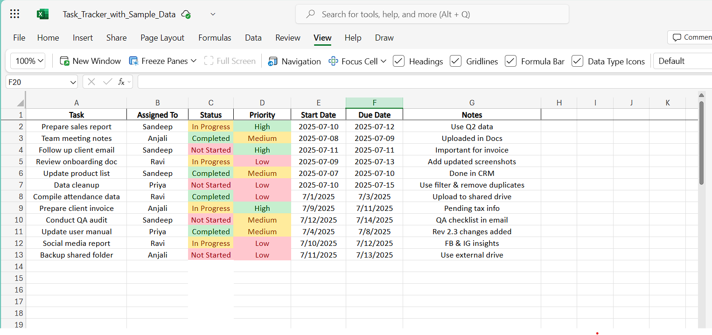

# task-tracker-documentation-tool
# Task Tracker & Documentation Tool

## Overview
This project is a simple task tracking and documentation tool built using Microsoft Excel. It simulates a basic operations workflow used in business environments for managing tasks, assignments, and status updates. The goal is to showcase process understanding, documentation clarity, and team ownership — ideal for roles like Process Executive at Cognizant.

## Features
- Task tracking with dynamic status updates (Not Started, In Progress, Completed)
- Dropdowns for consistency in "Status" and "Priority"
- Conditional formatting (Green = Completed, Yellow = In Progress, Red = Not Started)
- Team assignments, deadlines, and notes fields
- Visual formatting and clear structure
- Bonus: Priority-based color formatting (High, Medium, Low)

## Screenshot

> *Example of formatted Excel sheet showing task progress and priorities*

## How to Use
1. Open the file: `Task_Tracker_with_Sample_Data.xlsx`
2. Add or modify tasks as needed
3. Use dropdowns in **Status** and **Priority** for tracking
4. Apply conditional formatting if replicating from scratch
5. Track ownership, deadlines, and progress visually

## Tools Used
- Microsoft Excel
- (Optionally) Google Sheets for online collaboration

## GitHub Repo
📂 **Project Link:** [github.com/sandysandy-9/task-tracker-documentation-tool](https://github.com/sandysandy-9/task-tracker-documentation-tool)

## License
Free to use for learning, resume projects, and interview preparation.
